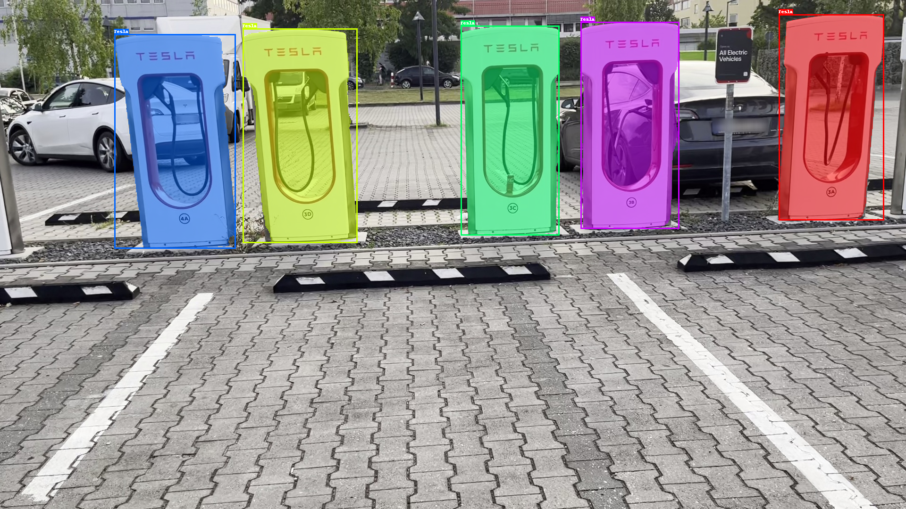
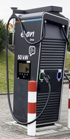
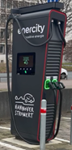
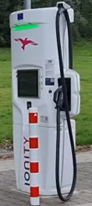
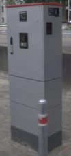
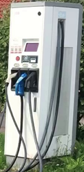
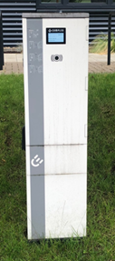
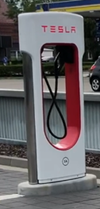

This user guide gives detailed information about the dataset and the detector baselines present in the VISCODA [EVCS BENCHMARK](https://www.viscoda.com/index.php/downloads/evcs-dataset).

# Dataset 

## Motivation
In recent years electric cars have been becoming more and more common.
Being able to detect electric vehicle charging stations (EVCS) can be helpful for comfort functions such as automated/assisted parking, e.g., by automatically selecting a parking space with charging option.
Since existing image datasets for driving scenarios like KITTI or Cityscapes do not contain annotated charging stations, we provide a dataset with high quality fine-grained EVCS annotations for training and evaluating object detection/instance segmentation algorithms.

## Dataset overview


The dataset consists of a total of 4394 images which were recorded as short videos at 3 frames per second in typical parking scenarios.
One part of the dataset was recorded using a test vehicle within the city of Hannover, Germany.
The remaining videos were recorded in different places in Europe using smartphone or GoPro cameras imitating typical parking maneuvers.

The recorded data is split into two subsets:
* **Part A:**  
3645 images with instance mask annotations of the 8 most frequently occuring EVCS types in the dataset.
Part A is further split into training/validation/and test subsets.
Examples of the eight annotated EVCS types are shown in the table below.  

| Name            | Image | Name               | Image |
|-----------------|-------|--------------------|-------|
| wallbe ZAS      |       | HYC 300            |       |
| HYC 150         |       | Tritium PK350      |       |
| Compleo DUO IMS |       | ABB Terra 50       |       |
| Compleo DUO     |       | Tesla Supercharger |       |

* **Part B:**  
749 images with 13 additional EVCS types that are less common. These are annotated at the superclass level as "electric vehicle charging station".


In addition to instance masks, each annotation also has a bounding box and a visibility score, with visibility score defined as follows:
- 0: fully visible
- 1: partly occluded/truncated but still clearly recorgnizable as EVCS by a human
- 2: heaviliy occluded/truncated and difficult to recognize as EVCS by a human.
- 3: heavily occluded/truncated and handly recognizable by a human without the video context.
 

## Dataset format
The dataset is provided using the well-known COCO-format for instance segmentation (https://cocodataset.org/#format-data).
That is, annotations are stored in one JSON file per subset with the following structure:
```
{
    "images": [image],
    "annotations": [annotation],
    "categories": [category]
}

image{
    "id": int,
    "width": int,
    "height": int,
    "file_name": str,
    "date_captured": datetime
    "site": str,  # this key value pair is not part of the standard COCO format
}

annotation{
    "id": int,
    "image_id": int,
    "category_id": int,
    "segmentation": [polygon],
    "area": int,
    "bbox": [x, y, width, height],
    "iscrowd": 0 or 1,
    "visibility": 0 or 1 or 2 or 3,  # this key value pair is not part of the standard COCO format
}

category{
    "id": int,
    "name": str,
    "supercategory": str
}
```

The key "site" was added to the image dictionary to provide the recording site id.  
The key "visibility" was added to the annotation dictionary to provide the visibility score.  
We set the "iscrowd" attribute to 1 for each annotation that has a visibility level of 3, such that those heavily occluded or truncated annotations are ignored during training and evaluation with [mmdetection](https://github.com/open-mmlab/mmdetection).

## Dataset download
The dataset can be downloaded at [VISCODA EVCS DATASET](https://evcs.viscoda.com/)
This EVCS Dataset by VISCODA GmbH is licensed under CC BY-NC-SA 4.0.


# Evaluation Benchmark
## Evaluation Protocol
This benchmark considers two detection scenarios:
* Fine grained EVCS detection (**eight-class**): Detecting EVCS at a fine-grained level, classifying them into the eight categories defined in Part A of the dataset. Training, validation and testing are performed on part A data.
* Supercategory EVCS detection (**one-class**): Detecting EVCS at a supercategory level with the class name "electric vehicle charging station", without distinguishing between specific types. Training and validation are conducted on the training and validation set of part A, respectively. Testing is performed on both the test sets of Part A and Part B.

The evaluation benchmark is built on top of [mmdetection](https://github.com/open-mmlab/mmdetection). Three detection setups are built, including:
* Fine-Tuning: train the eight-class and one-class detector variant starting from an object detector with pre-trained weights, e.g., pre-trained on COCO. The fine tuning is conducted for the full set of network parameters.
* Zero Shot: evaluates how well pre-trained open-set detectors can transfer to detect EVCS, a less common type of object, at super-class and fine-grained class level. Directly apply the pre-trained open-set detectors to EVCS **eight-class** and **one-class** detection. This is only possible for open-set detectors.
* Promt Tuning: This refers to tuning the input text features of open set detectors while fixing the weights of other network modules to enhance the EVCS detection performance. Both eight-class and one-class detection are tested under this setup.

## Model configs

Model configs are contained in the software
| Detector | Backbone | Setup| #Class |Config File |
| :------: | :------: | :------: | :------: | :------: |
| Faster-RCNN-R50   |   R50  |   FineTune  | 8 | model_configs/configs/faster-rcnn/faster-rcnn_r50_fpn_1x_greenautoml_evcs_pretrained_batch_size_8.py|
| Faster-RCNN-R101  |   R101 |   FineTune  | 8 | model_configs/configs/faster-rcnn/faster-rcnn_x101-32x4d_fpn_1x_coco_greenautoml_evcs_pretrained_batch_size_5.py| 
| YOLOX-s           |   CSPDarkNet | FineTune | 8 | model_configs/configs/faster-rcnn/yolox/yolox_s_greenautoml_evcs.py| 
| YOLOX-l           |   CSPDarkNet Larger | FineTune | 8 | model_configs/configs/faster-rcnn/yolox/yolox_l_greenautoml_evcs.py |
| DINO-L-FT | Swin-L | FineTune | 8 | model_configs/configs/faster-rcnn/yolox/dino/dino-5scale_swin-l_8xb2-12e_coco.py|
|Grounding-DINO-t-FT | Swin-t | FineTune | 8 | model_configs/configs/grounding_dino/grounding_dino_swin-t_finetune_8xb2_20e_evcs_closeset_dataset1.1_greenautoml.py|
|Grounding-DINO-one-class-t-FT | Swin-t | FineTune | 1 |model_configs/configs/grounding_dino/grounding_dino_swin-t_finetune_8xb2_20e_evcs_one_class_greenautoml.py|
|Grounding-DINO-one-class-t-PT | Swin-t | Prompt Tuning | 1 | model_configs/GroundingdinoPT/config/grounding_dino_swinT_EVCS_oneclass_mmpretrained_additional_dataset1.1_prompt.py|

## Training and test commands

To prepare the training of all base models in our paper, the mmdetection framework must be set up first. For more details about this step, please refer to https://mmdetection.readthedocs.io/en/latest/get_started.html

Afterwards, copy model configs to the folder of mmdetection/configs.
via the following commands:
```
mkdir mmdetection/configs/greenautoml
cp -r model_configs/configs/. mmdetection/configs/greenautoml
cp -r model_configs/GroundingdinoPT mmdetection/projects
```

In default, the data is located under mmdetection/data. If you placed the EVCS data in your own path, adapt the training data root in config files accordingly by change data_root.

The pretrained models on COCO are also needed, please download them in the official mmdetection model ZOO: https://github.com/open-mmlab/mmdetection?tab=readme-ov-file 

Now, trainings can be started by using the following commands:
```
cd mmdetection
python tools/train.py CONFIG_FILE
python tools/test.py CONFIG_FILE MODEL_FILE 
```
Note, in the model config, the training dynamics are set to be visualized by tensorboard in default. If you follow this option, please install tensorboard by running "pip install future tensorboard".

## Prompt-Tuning 
Please refer to [Prompt Tuning of Grounding-DINO for EVCS](README_PromptTuning.md)


